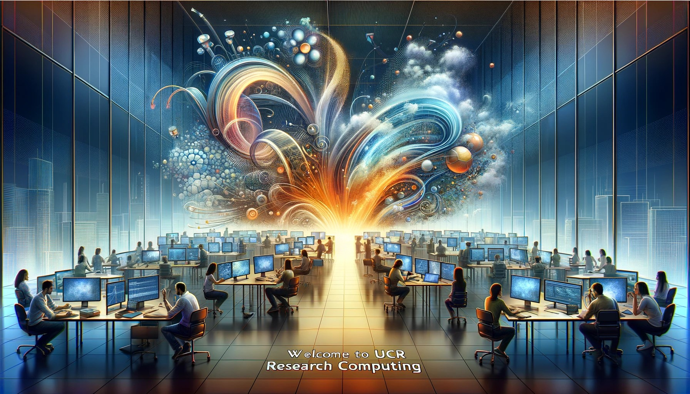

# UCR Research Computing Knowledge Base

Welcome to the UCR Research Computing Knowledge Base! This comprehensive resource hub provides information and guides for all aspects of research computing at UCR, from getting started to advanced topics.  Use the categories below or the search bar above to find the information you need.

## Getting Started

*   [Introduction to Research Computing at UCR](intro-research-computing-guide.md)
*   [About Research Computing at UCR](../pages/about.md)

## Computing Resources

### High-Performance Computing (HPC)

*   [Available HPC Clusters (Ursa Major, etc.)](Available_Clusters.md)
*   [BLAST Searches on the HPCC Cluster](blast.md)
*   [Launching and Managing HPC Clusters](How_To_Launch_a_Ursa_Major_Cluster.md)
*   [Launching Custom Ursa Major Cluster](Launch_Custom_Ursa_Major_Cluster.md)
*   [HPC Job Scheduling (Slurm)](how_to_connect_to_hpc_cluster_run_sample_job.md)
*   [Ursa Major HPC Clusters](Ursa_Major_HPC_Clusters.md)
*   [HPCC](../pages/HPCC.md)
*   [Building an HPC Cluster](../pages/Building_an_HPC_Cluster.md)
*   [Comprehensive Guide to Warewulf HPC Cluster Deployment](../pages/Comprehensive_Guide_to_Warewulf_HPC_Cluster_Deploy.md)
*   [Open Science Grid](../pages/open_science_grid.md)
*   [Submit Job to OSG](submit-job-to-osg.md)

### Cloud Computing

*   [Cloud Computing Overview](../pages/computing-resources-overview.md)
*   [GCP and AWS Cloud Credits](../pages/GCP_and_AWS_Cloud_Credits.md)
*   [GCP Subscription Agreements](../pages/gcp_subscription_agreements.md)
*   [Using Google Cloud Platform (GCP)](./README.md)
*   [Mounting Google Cloud Storage](how_to_mount_google_cloud_storage.md)
*   [GCS and AWS S3](../pages/gcs_aws_s3.md)
*   [Google Drive](../pages/Google_Drive.md)
*   [Creating a Budget for a Ursa Major/Cloud Project](Ursa_Major_Project_Budget_Creation.md)
*   [AWS for Research Computing](./README.md)
*   [Globus Transfer](Globus_Transfer.md)
*   [gnextnext5](gnextnext5.md)

### AI/ML and Edge Computing

*   [AI/ML Overview](../pages/ai-ml.md)
*   [AI-Optimized HPC Clusters](../pages/ai-hpc-cluster.md)
*   [Ursa Major Research Services for AI/ML](Ursa_Major_Research_Services.md)
*   [LLM Inference Settings](llm-inference-settings.md)
*   [The Edge AI Revolution](../pages/Edge_AI_Revolution.md)
*   [Building AI-Optimized High-Performance Computing](../pages/Building_AI-Optimized_High-Performance_Computin.md)

### Other Computing Resources

*   [Ursa Major Research Workstations](Ursa_Major_Research_Workstations.md)
*   [Connecting to a Ursa Major Research Workstation](Ursa_Major_Research_Workstations_How_to_Connect.md)
*   [Launching a Ursa Major Research Workstation](Ursa_Major_Research_Workstations_How_to_Launch.md)
*   [Research Workstations](Research_Workstations.md)
*   [The Nautilus Cluster (Kubernetes)](The_Nautilus_Cluster.md)
*   [Nautilus](../pages/Nautilus.md)
*   [Linux Manual](Linux_Manual.md)
*   [Local Lab Storage](Local_Lab_Storage.md)
*   [On-Prem Facilities](../pages/on-prem-facilities.md)
*   [Web-Based Research Tools](../pages/web-based-research-tools.md)

## Data Storage

*   [Storage Overview](../pages/storage-overview.md)
*   [Ursa Major Secure Research Storage](Ursa_Major_Secure_Research_Storage.md)
*   [Ursa Major Research Storage](Ursa_Major_Research_Storage.md)
*   [How to: Create a Ursa Major Research Storage Bucket](Ursa_Major_Research_Storage_How_to_Create_Bucket.md)
*   [How to: Access a Ursa Major Research Storage Bucket](Ursa_Major_Research_Storage_How_to_Access_Bucket.md)
*   [S3 Auto Migrate and Delete](how-to-s3-auto-migrate-delete.md)
*   [Ceph Secure Research Storage](../pages/ceph_secure_research_storage.md)
*   [Dryad](../pages/dryad.md)
*   [Ursa Major Data](../pages/ursa_major_data.md)

## Software and Tools

*   [Research Software on Ursa Major Cluster](https://spack.readthedocs.io/en/latest/package_list.html)
*   [Installing R JAGS on Ursa Major](R-JAGS.md)
*   [Molecular Dynamics Simulation Input Files with ChatGPT](md_simulation_input_files_chatpgt.md)
*   [UCR Research Computing Github Org](https://github.com/UCR-Research-Computing):
*   [Offline LLMs (Ollama)](ollama-how-to.md)
*   [Software and Application Support](../pages/software_and_application_support.md)

## Research Facilitation

*   [Research Facilitation Overview](../pages/research_facilitation.md)
*   [Grant Colab](../pages/grant_colab.md)
*   [Ursa Major Ask](../pages/ursa-major-ask.md)

## Support and Training

*   [Lab Support](../pages/lab-support.md)
*   [UCR Research Computing System Administration Service (RCSAS)](UCR_Research_Computing_System_Administration_Service.md)
*   [RCSAS MOU](https://docs.google.com/document/d/19nYYXakruAbg1pxKybpSddSz8p1TBiBc/edit?usp=sharing&ouid=115996119773834121624&rtpof=true&sd=true)
*   [Research Computing Services](Research_Computing_Services.md)
*   [Resources](Resources.md)
*   [Online Courses](../pages/online_courses.md)
*   [Workshops and Webinars](../pages/workshops_and_webinars.md)

## Policies and Security

*   [Policies](../pages/policies.md)
*   [Ursa Major Policy](Ursa_Major_Policy.md)
*   [UCR Data Security Plans](UCR_Data_Security_Plans.md)
*   [Research Security](../pages/research_security.md)
*   [Backup](../pages/backup.md)
*   [Cost Models](../pages/cost_models.md)
*   [GCP, AWS, EDP](../pages/gcp_aws_edp.md)
*   [HPCC GPFS](../pages/hpcc_gpfs.md)
*   [NSF Access](../pages/nsf_access.md)

## Best Practices

*   [Cloud Cost Management](./README.md)
*   [Collaborative Research using Cloud Platforms](./README.md)
*   [Data Security in Research Computing](./README.md)
*   [Ursa Major Policy](./README.md)
*   [SSH to Access](ssh-to-access.md)
*   [Building a Mature Research Computing Service](../pages/Building_a_Mature_Research_Computing_Service.md)
*   [Research Infrastructure Support](../pages/research_infrastructure_support.md)
