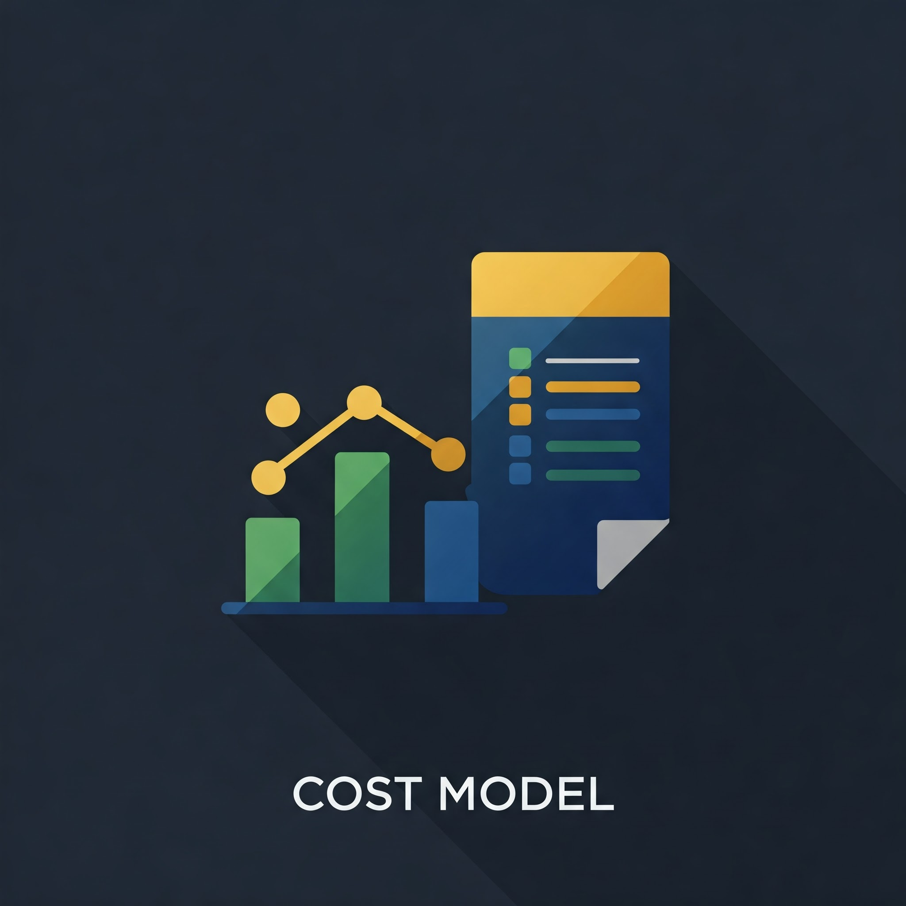

## Cost Models

We prioritize strategic alignment with our university's mission and the practical needs of accessing computational resources. Our funding support and cost models are designed to advance research by providing equitable access to state-of-the-art computational tools. Drawing from industry best practices and our strategic objectives, we have crafted a cost model framework that caters to the diverse requirements of our dynamic research community.

Our model offers a variety of funding support and cost options to facilitate research endeavors across all disciplines. These options include System-Wide Discounted Rates, UCR Subsidized Access, the Condo Model for shared resources, No-Cost Access for specific initiatives, and Direct Cost Options for project-specific funding. This approach ensures flexibility, promoting the efficient use of resources and supporting a range of research activities, from nascent inquiries to extensive, data-driven projects.

### NSF-Based Resources

NSF-Based Resources are tailored to boost the research capabilities of the scientific community across a wide range of disciplines, and they're provided at no cost to researchers. This is made possible by funding from the National Science Foundation (NSF), a US government agency that backs fundamental research and education in all non-medical fields of science and engineering. Through this support, the NSF seeks to push the boundaries of knowledge, drive innovation, and tackle societal challenges, all without imposing any financial burden on researchers.

* [ACCESS Program](nsf_access.md): Provides no-cost access to advanced computing systems and services, funded by the NSF.
* [Open Science Grid](open_science_grid.md):: Provides no-cost access to distributed high-throughput computing resources.
* [NRP Nautilus Cluster](Nautilus.md): Provides no-cost access to regional HPC resources via the Pacific Research Platform.

### System-Wide Discounted

Negotiated agreements that the University of California, Riverside (UCR) has established with major cloud service providers like Amazon Web Services (AWS), Google Cloud Platform (GCP), and Microsoft Azure. These agreements are designed to offer the entire UCR community—spanning from students and faculty to research departments—access to cloud computing resources at reduced prices. By leveraging the collective bargaining power of the entire university system, UCR has been able to secure discounts on a range of cloud services, including computing power, data storage, and content delivery services.

These system-wide discounts make cloud computing more affordable for UCR's research and academic projects, enabling users to scale their computational resources according to their specific needs without incurring the full cost.

* [AWS Enterprise Discount Program](gcp_aws_edp.md): Cost-effective AWS access for cloud computing.
* [GCP Enterprise Discount Program](gcp_aws_edp.md): Additional access to GCP resources through UC system-wide agreement.
* [Individual GCP Subscription Agreements](gcp_subscription_agreements.md): Tailored resources for large-scale workflows.
* Storage Solutions: [Google Cloud Storage](gcs_aws_s3.md) and [AWS S3](gcs_aws_s3.md) for Storage.

### Currently UCR Subsidized

Resources and services that the University of California, Riverside (UCR) provides to its community without charging the end users, as UCR covers some or all of the associated costs. This arrangement includes access to specific cloud computing resources, high-performance computing platforms, and storage solutions, among other technological services. By subsidizing these services, UCR aims to eliminate financial barriers that might otherwise prevent students, faculty, and research departments from utilizing essential digital tools and platforms for their academic and research projects.

* [Ursa Major](ursa_major.md): GCP subscription for cloud computing resources, auto-scaling HPC, GKE Clusters with the latest technology, Research Workstations/Servers and Advanced AI and ML platforms
* Storage Solutions: [Google Drive](Google_Drive.md) and [Ursa Major Secure Research Storage](/Knowledge_Base/Ursa_Major_Research_Storage.md): For storage and collaboration.
* [Dryad](https://datadryad.org/stash): For publishing research data for enhanced discoverability and compliance.

### No Cost Cloud Research Credits

Cloud research credits available to the University of California, Riverside (UCR) community, provided by cloud service providers like Amazon Web Services (AWS) and Google Cloud Platform (GCP). These credits allow researchers, students, and faculty to access advanced cloud computing resources for their projects without incurring costs. The initiative supports a wide array of research and educational activities by offering free access to computing power, data storage, and analytics tools. By applying for these credits, UCR community members can utilize cutting-edge technology for innovative research, fostering an environment of exploration and learning at no financial burden. This approach promotes accessibility to advanced resources, supporting UCR's commitment to advancing academic and research excellence.

* [AWS Cloud Credits](GCP_and_AWS_Cloud_Credits.md): Credits for AWS usage.
* [GCP Cloud Credits](GCP_and_AWS_Cloud_Credits.md): Credits for GCP usage.

### Subscription-Based

Some on-premises services offered by the University of California, Riverside (UCR) that require a subscription fee for access. These services typically include access to high-performance computing (HPC) clusters, specialized software, and secure research storage solutions that are physically located on campus. By adopting a subscription-based model, UCR ensures that these critical resources are sustainably funded and maintained, allowing for ongoing upgrades and support.

This model allows researchers, faculty, and students to access powerful computational resources and data storage capabilities necessary for complex simulations, data analysis, and other research activities that demand robust infrastructure. The subscription fees are structured to cover the costs of hardware, software licenses, technical support, and the continuous improvement of these on-premises resources.

* [HPCC Cluster](HPCC.md): Central Campus High-performance clusters for compute-intensive tasks.
* [HPCC-GPFS Cluster Storage](hpcc_gpfs.md): High-performance cluster storage.
* [Ceph Secure Research Storage](ceph_secure_research_storage.md): Additional storage over the base allocation.

### On-Prem No Cost

"On-Prem No Cost" signifies the University of California, Riverside (UCR) offering certain on-premises research support services and a base amount of Ceph research storage at no charge to its community. This arrangement includes access to local high-performance computing support, research facilitation services, and a foundational level of secure data storage without incurring any direct costs to the users. These resources are designed to support a wide range of academic and research activities, enabling faculty, students, and researchers to leverage essential computing and storage capabilities for their projects.

By providing these no-cost services, UCR aims to remove financial barriers to research infrastructure, ensuring equitable access to necessary tools for data analysis, computational research, and secure data storage. The inclusion of a base amount of free Ceph storage allows users to manage and store data efficiently, supporting the integrity and accessibility of research data across various disciplines.

* [RCSAS Local Cluster Support](rcsas.md): Custom support for researcher clusters, labs, and storage systems.
* [Research Computing Research Facilitation and Support](research_facilitation.md): Assistance with research projects grants grants.
* [Ursa Major Support](ursa_major.md): Collaboration, training, and support for cloud-based research systems.
* [Ceph Secure Research Storage](ceph_secure_research_storage.md): Secure central research storage solution for research data on campus.

### Condo Model

The "On-Prem Condo Model" at the University of California, Riverside (UCR) represents a collaborative approach to on-premises high-performance computing (HPC) resources. In this model, faculty and departments contribute financially to the acquisition of HPC resources, such as compute nodes or storage, in exchange for priority access and a portion of the overall computing capacity. This investment allows contributors to secure a dedicated slice of computational power while also benefiting from shared access to the larger pool of resources.

This model is designed to balance individual research needs with collective access, optimizing the use of HPC facilities by ensuring that resources are efficiently utilized across the university. It enables researchers with significant computational demands to have guaranteed access to resources tailored to their specific projects, while still contributing to the communal HPC ecosystem at UCR.

The Condo Model fosters a sense of community and shared investment in research infrastructure, encouraging collaboration and efficient resource use. By participating, departments and research groups can leverage state-of-the-art computational resources at a fraction of the cost of individual ownership, while also supporting the broader research capabilities of UCR. This approach underscores UCR's commitment to providing flexible and scalable research computing solutions that accommodate a wide range of academic and scientific endeavors.

* [HPCC Cluster](HPCC.md): Central Campus High-performance clusters for compute-intensive tasks.
* [HPCC-GPFS Cluster Storage](hpcc_gpfs.md): High-performance cluster storage.
* [Ceph Secure Research Storage](ceph_secure_research_storage.md): Additional storage over the base allocation.

### Web-Based Resources

"Web-Based Research Tools and Resources" at the University of California, Riverside (UCR) are online services available to researchers for a fee. These tools are paid for by the researchers and include functionalities like data analysis, visualization, and collaboration, essential for supporting research activities. Accessing these resources allows UCR researchers to use advanced technologies for their projects, enhancing productivity and innovation.

* [Web-Based Research Tools](web-based-research-tools.md): Various tools available for researchers
* [CrashPlan Backup](backup.md): Offers backup services for data protection and disaster recovery.

Below is a resource to cost model matrix:

| Resource Name                                   | System-Wide Discounted | Currently UCR Subsidized | Subscription-Based | Condo Model | No Cost | Cost |
|-------------------------------------------------|------------------------|--------------------------|--------------------|-------------|---------|------|
| **NSF-Based Resources**                         |                        |                          |                    |             |         |      |
| ACCESS Program                                  |                        |                          |                    |             | ✔       |      |
| Open Science Grid                               |                        |                          |                    |             | ✔       |      |
| NRP Nautilus Cluster                            |                        |                          |                    |             | ✔       |      |
| **Cloud Resources**                             |                        |                          |                    |             |         |      |
| AWS Enterprise Discount Program                 | ✔                      |                          |                    |             |         | ✔    |
| GCP Enterprise Discount Program                 | ✔                      |                          |                    |             |         | ✔    |
| Individual GCP Subscription Agreements          |                        |                          |                    |             |         | ✔    |
| Google Cloud Storage and AWS S3 for Storage     |                        |                          |                    |             |         | ✔    |
| Ursa Major                                      |                        | ✔                        |                    |             | ✔       |      |
| Google Drive and Ursa Major Secure Storage      |                        | ✔                        |                    |             | ✔       |      |
| Dryad                                           |                        | ✔                        |                    |             | ✔       |      |
| AWS Cloud Credits                               |                        |                          |                    |             | ✔       |      |
| GCP Cloud Credits                               |                        |                          |                    |             | ✔       |      |
| Ursa Major Support                              |                        | ✔                        |                    |             | ✔       |      |
| **On-Premise Resources**                        |                        |                          |                    |             |         |      |
| HPCC Cluster                                    |                        |                          | ✔                  | ✔           |         |      |
| HPCC-GPFS Cluster Storage                       |                        |                          | ✔                  | ✔           |         |      |
| Ceph Secure Research Storage                    |                        |                          | ✔                  | ✔           |         |      |
| RCSAS Local Cluster Support                     |                        |                          |                    |             | ✔       |      |
| Research Facilitation and Support               |                        |                          |                    |             | ✔       |      |
| **Web-Based Resources**                         |                        |                          |                    |             |         |      |
| Web-Based Research Tools                        |                        |                          |                    |             |         | ✔    |
| CrashPlan Backup                                |                        |                          |                    |             |         | ✔    |
