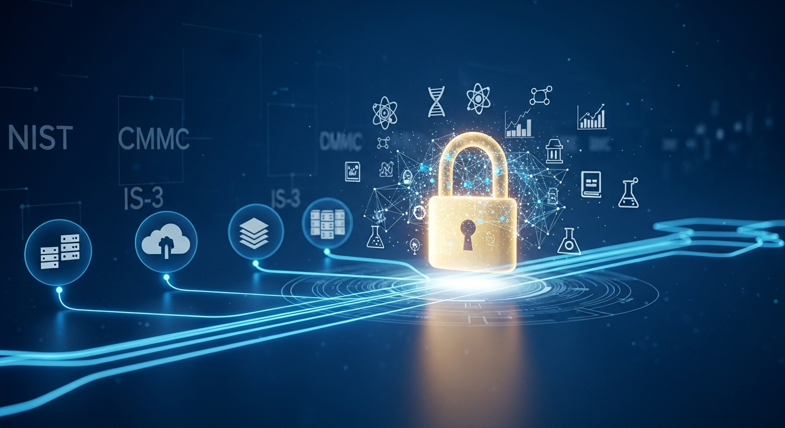

## Research Security

At the University of California, Riverside (UCR), ensuring the security of research data is a priority. We work closely with UCR's Information Security Team to provide comprehensive consulting services on securing your research projects. Our goal is to ensure that all research activities meet the highest standards of data security, complying with relevant regulations and university policies. Understanding and adhering to records retention policies is also a critical component of responsible data management. For guidance, please refer to the [UC Riverside Research Records Retention: A Quick Guide for Researchers](./ucr_research_records_retention_guide.md).

We assist researchers in several key areas:

- **Understanding Your Research Security**: We delve into the specifics of your research to identify any applicable regulations, requirements, and necessary controls.
- **Data Security Plan**: We aid in developing a Data Security Plan for your project. The DSP outlines Roles, Responsibilities, Guidelines, Processes, and Controls essential for safeguarding your data. For full details on the DSP intake process, see our [UCR Data Security Plans](./Knowledge_Base/ucr-data-security-plans) page.
- **Implementation**: Our team is here to help implement the plans or controls developed, ensuring your research data is secure within approved environments.

We encourage researchers to connect with the Research Computing Team to explore how we can support your data security needs.

<button id="ai-guide-toggle">A Guide to the Safe and Secure Use of Artificial Intelligence in Research</button>

### Introduction
Artificial Intelligence (AI) presents transformative opportunities for research across all disciplines at UC Riverside. From analyzing vast datasets to generating novel hypotheses, AI tools can accelerate discovery and innovation. However, the use of AI also introduces new challenges related to data security, privacy, and research integrity.
This document provides a comprehensive guide for all UCR researchers on the approved use of AI models and infrastructure. It is designed to help you navigate the complexities of using AI in your work while ensuring compliance with University of California policies, particularly the UC Information Security Policy IS-3, and protecting the confidentiality and integrity of of your research data.

### Approved AI Models
Researchers have access to a wide range of AI models. The appropriate model for your research will depend on your specific needs, the nature of your data, and the approved infrastructure you are using.

#### Closed-Source Models
**Gemini (via Google Cloud):** Google's Gemini family of models is approved for use within the UCR-managed Google Cloud environment ("Ursa Major"). These models offer state-of-the-art capabilities for a variety of tasks.
*Data Privacy:* When used within the UCR Google Cloud environment, your data is not used to train Google's models, and your prompts and data remain within the UCR tenant.

#### Open-Source Models
**Via Vertex AI Model Garden on Google Cloud:** UCR's "Ursa Major" Google Cloud environment provides access to a curated list of open-source models through the Vertex AI Model Garden. This is the recommended way to use open-source models for most research.
**On-Premise (HPCC or a private system):** Researchers can run open-source models on the UCR High-Performance Computing Center (HPCC) or on their own secure, departmentally-managed systems (subject to strict physical location guidelines).

### What is Vertex AI?
Vertex AI is Google Cloud's unified machine learning (ML) platform, designed to help researchers and developers build, deploy, and scale ML models more efficiently. It provides a comprehensive suite of tools that support the entire ML lifecycle, from data preparation to model deployment and management, all within a single interface. For UCR researchers, it is the primary gateway to accessing advanced AI capabilities on Google Cloud.

**Key Capabilities of Vertex AI:**
- **Unified Environment:** It brings together all of Google's cloud services for building ML under one roof, eliminating the need to piece together separate services.
- **Data Preparation & Labeling:** Provides tools to ingest, analyze, and prepare your datasets for training, including data labeling services to create high-quality training data.
- **AutoML & Custom Training:** Researchers can use AutoML to automatically train high-quality models with minimal effort and ML expertise, or use Custom Training to have full control over the model architecture and training process using popular frameworks like TensorFlow, PyTorch, and Scikit-learn.
- **Model Garden:** As mentioned, this is a central repository of pre-trained and open-source models (including from Hugging Face) that can be easily deployed or fine-tuned for specific research tasks.
- **MLOps Tools:** Vertex AI includes a robust set of MLOps (Machine Learning Operations) features, such as pipelines for automating workflows, a model registry for versioning and management, and monitoring tools to track model performance and detect drift. This helps ensure that your research is reproducible, scalable, and manageable over time.
- **Generative AI Studio:** A dedicated environment within Vertex AI for prototyping and customizing generative AI models like Gemini. Researchers can design prompts, tune models with their own data, and deploy them for use in applications.

### Approved Infrastructure and Data Usage
The infrastructure you use to run AI models is directly tied to the level of data protection required for your research. **UCR does not support or approve the use of standalone workstations in individual offices for highly sensitive (P3/P4) data.**

| Infrastructure | Approved Models | P1 Data | P2 Data | P3 Data | P4 Data |
| :--- | :--- | :--- | :--- | :--- | :--- |
| **UCR "Ursa Major" Google Cloud (Tier 1)** | Gemini, Vertex AI | ✅ | ✅ | ❌ | ❌ |
| **UCR Google Cloud (Tier 2 Recharge)** | Gemini, Vertex AI | ✅ | ✅ | ✅ | ✅ |
| **UCR High-Performance Computing Center (HPCC)** | Open-Source Models | ✅ | ✅ | ✅ | ❌ |
| **CHASS Server Room (On-Premise)** | Open-Source Models | ✅ | ✅ | ✅ | ✅ |

**⚠️ Important Considerations for P3/P4 Data:**
- **P3-P4 Data in Google Cloud:** Standard sensitive research data must go into a GCP Tier 2 Direct Recharge project. It is not covered by the subsidized Tier 1 pool.
- **P3-P4 Data On-Premise:** On-premise hosting for P3/P4 data is strictly limited to the secure CHASS Server Room for researchers within the College of Humanities, Arts, and Social Sciences (CHASS).
- **Federal High-Compliance (CMMC, NIST 800-171, NIH dbGaP):** These workloads are restricted exclusively to the **UCR Secure Enclave** (a specialized Tier 2 GCP environment).

#### Understanding your Research Security

Understanding and adhering to security policies and regulations is critical for safeguarding research data at UCR. All research data falls under a classification of security level ranging from P1 to P4, refer to the detailed descriptions of each level on the UCOP Security Classification page: [UCOP Information Security Classification Standards](https://security.ucop.edu/policies/institutional-information-and-it-resource-classification.html):
- **P1/P2** involving data without Personal Identifiable Information (PII)—P1 being public and P2 internal.
- **P3/P4** categories deal with data containing PII, necessitating a [Data Security Plan](./Knowledge_Base/ucr-data-security-plans), where P3 is classified as sensitive and P4 as confidential.

By default, the systems we build and manage at UCR Research Computing are designed to comply with the UC IS-3 policy at the P2 level, ensuring a robust foundation for data security and integrity. While our infrastructure supports projects up to P4 level, accommodating the highest levels of data sensitivity, it is important to note that we do not support the handling of US classified data.

### Meeting Federal Compliance: NIST 800-171, CMMC, & NIH dbGaP

Many federal grant proposals now include strict requirements for data security. If your grant or DUA involves the Department of Defense (DoD), Department of Energy (DOE), NIH dbGaP, or mandates specific federal compliance frameworks like **CMMC** or **NIST 800-171**, this is handled specially.

*   **Our Solution: The UCR Secure Enclave** 
    The UCR Secure Enclave is the official campus environment purpose-built to meet the technical controls required by NIST 800-171 and handle CUI (Controlled Unclassified Information) and NIH dbGaP data. By using the UCR Secure Enclave, your lab is operating in an environment that provides the necessary technical foundation to meet CMMC Level 2 controls, enabling you to pursue DoD-funded research.

#### **How to Proceed**

Navigating these requirements is complex. If your grant proposal or DUA mentions CUI, NIST 800-171, CMMC, or NIH dbGaP, please contact us immediately. We will work with you and the Information Security Office to develop the required Data Security Plan (DSP).

**Important:** Due to the significant security and monitoring overhead, the UCR Secure Enclave is a premium **Tier 2 (Direct Recharge)** service and requires a grant-funded Chart of Accounts (COA). 

#### Computing Resources and Security Classifications

| Resource Type | Resource | Description | Top Security Classification | Remarks |
|---------------|----------|-------------|-----------------------------|---------|
| Compute | **High-Performance Computing Center (HPCC)** | A key resource for intensive computational tasks. | P3 | Suitable for a broad range of research workflows. |
| Compute | **GCP Tier 2 Recharge** | Standard secure Google Cloud project shells. | P4 | Requires a grant-funded COA. Standard P3/P4 data. |
| Compute | **UCR Secure Enclave (GCP)** | Highly specialized, locked-down GCP environment. | P4 / NIST 800-171 / CMMC | Tier 2 Recharge. Required for NIH dbGaP, DoD, DOE, CUI. |
| Compute | **CHASS Server Room** | On-premise secure physical hosting. | P4 | Strictly limited to CHASS researchers. No office workstations. |
| Storage | **HPCC-GPFS Cluster Storage** | High-performance cluster storage attached to the HPCC. | P3 | High-speed, parallel computing storage suitable for compute-intensive tasks. |
| Storage | **Ceph Secure Research Storage** | Scalable, resilient storage solution designed for diverse research needs. | P3 | Upcoming enhancement to UCR's research computing infrastructure. |
| Storage | **UCR Google Drive** | Cloud-based storage solutions for collaboration. | P3 | P3 data allowed with strict sharing controls. P4 generally prohibited unless authorized by ISO. |

#### Collaboration for Security

Collaborating with UCR's Research Computing Team ensures that your research projects are secure and compliant with the latest data protection standards. Our team is dedicated to supporting UCR researchers in navigating the complexities of research security, offering tailored solutions that meet the unique needs of each project.

